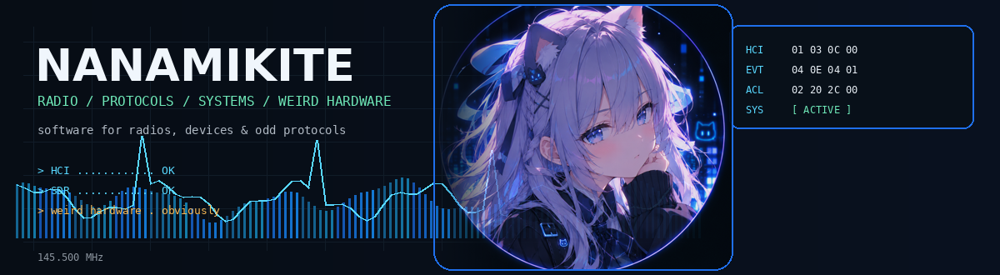
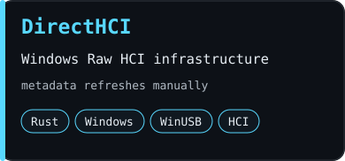
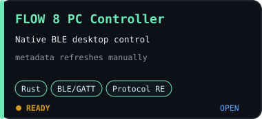
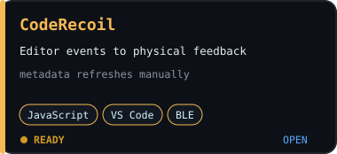

 

<b>Building software around radios, protocols, devices, and hardware that probably deserved better software.</b>

## Featured projects

**Signal path**  
`Hardware → USB / BLE / CAT / IQ → Protocol analysis → Systems → Desktop tools`

**Currently messing with**  
`Bluetooth HCI` · `SDR` · `radio tooling` · `protocol analysis` · `strange hardware`

**Selected engineering**  
`IDE tooling` · `plugin systems` · `hardware integration` · `project automation` · `upstream contributions`

<b>More projects</b>

 

- [radioManger](https://github.com/NanamiKite/radioManger) — amateur-radio station management
- [PiRadioBox](https://github.com/NanamiKite/PiRadioBox) — Raspberry Pi radio tooling
- [Pulsedesk](https://github.com/NanamiKite/Pulsedesk) — heart-rate telemetry visualization for OBS

<b>How I build</b>

 

I use AI coding agents extensively as part of my development workflow. I focus on problem definition, architecture, protocol/device analysis, integration, debugging, real-hardware validation, and reviewing how the resulting system actually behaves.

I'm gradually working backwards through the stack and learning the underlying pieces more deeply instead of treating generated code as a black box.

 

Building things because apparently leaving weird hardware alone is not an option.

