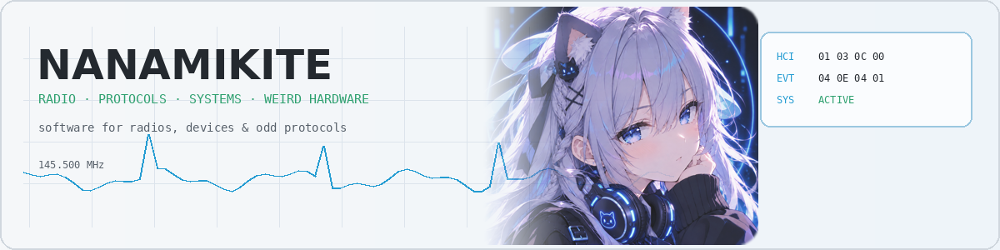
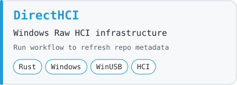
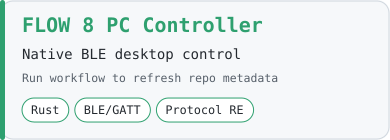
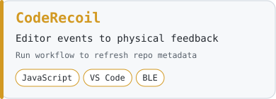

<picture>
  <source media="(prefers-color-scheme: dark)" srcset="./assets/banner-dark.png">
  <source media="(prefers-color-scheme: light)" srcset="./assets/banner-light.png">
  
</picture>

 

### Building software around radios, protocols, devices, and hardware that probably deserved better software.

## Featured projects

<a href="https://github.com/NanamiKite/DirectHCI">
<picture>
  <source media="(prefers-color-scheme: dark)" srcset="./assets/generated/directhci-dark.svg">
  <source media="(prefers-color-scheme: light)" srcset="./assets/generated/directhci-light.svg">
  
</picture>
</a>
<a href="https://github.com/NanamiKite/FLOW-8-PC-Controller">
<picture>
  <source media="(prefers-color-scheme: dark)" srcset="./assets/generated/flow8-dark.svg">
  <source media="(prefers-color-scheme: light)" srcset="./assets/generated/flow8-light.svg">
  
</picture>
</a>
<a href="https://github.com/NanamiKite/CodeRecoil-for-Coyote-2.0">
<picture>
  <source media="(prefers-color-scheme: dark)" srcset="./assets/generated/coderecoil-dark.svg">
  <source media="(prefers-color-scheme: light)" srcset="./assets/generated/coderecoil-light.svg">
  
</picture>
</a>

### Signal path
`Hardware → USB / BLE / CAT / IQ → Protocol analysis → Systems → Desktop tools`

### Currently messing with
`Bluetooth HCI` · `SDR` · `radio tooling` · `protocol analysis` · `strange hardware`

### Selected engineering
IDE tooling · plugin systems · hardware integration · project automation · upstream contributions

<b>More projects</b>

 

- [radioManger](https://github.com/NanamiKite/radioManger) — amateur-radio station management
- [PiRadioBox](https://github.com/NanamiKite/PiRadioBox) — Raspberry Pi radio tooling
- [Pulsedesk](https://github.com/NanamiKite/Pulsedesk) — heart-rate telemetry visualization for OBS

 

Building things because apparently leaving weird hardware alone is not an option.

