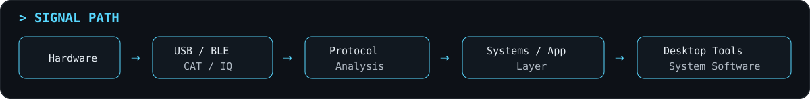
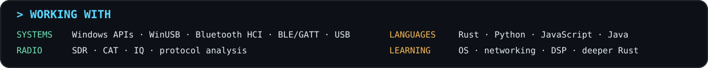
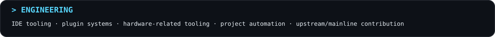

<b>Building software for radios, devices, protocols and odd hardware.</b> 
Most projects start with “I have this weird piece of hardware. Let's figure out how it works.”

## `> FEATURED PROJECTS`

 

 

<code>&gt; MORE PROJECTS</code>

 

- [radioManger](https://github.com/NanamiKite/radioManger) — amateur-radio station management
- [PiRadioBox](https://github.com/NanamiKite/PiRadioBox) — Raspberry Pi radio tooling
- [Pulsedesk](https://github.com/NanamiKite/Pulsedesk) — heart-rate telemetry visualization for OBS

<code>&gt; HOW I BUILD</code>

 

I use AI coding agents extensively as part of my development workflow. I focus on problem definition, architecture, protocol/device analysis, integration, debugging, real-hardware validation, and reviewing how the resulting system actually behaves.

I'm gradually working backwards through the stack and learning the underlying pieces more deeply instead of treating generated code as a black box.

 

Building things because apparently leaving weird hardware alone is not an option.

