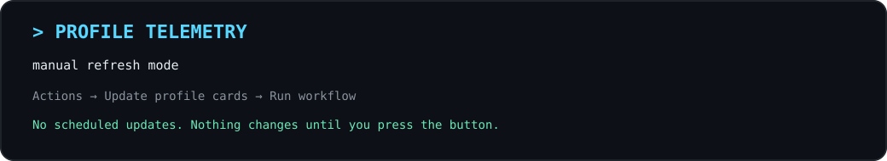
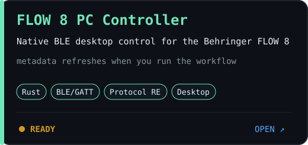
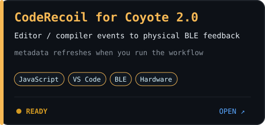

<div align="center">


<br>



</div>

I build software around **radios, Bluetooth devices, protocols, and odd hardware**.

Most projects start with some variation of:

> I have this weird piece of hardware.  
> The existing software annoys me.  
> Let's figure out how it works.

## `// FEATURED PROJECTS`

<table>
<tr>
<td width="50%">
<a href="https://github.com/NanamiKite/DirectHCI">

</a>
</td>
<td width="50%">
<a href="https://github.com/NanamiKite/FLOW-8-PC-Controller">

</a>
</td>
</tr>
<tr>
<td width="50%">
<a href="https://github.com/NanamiKite/CodeRecoil-for-Coyote-2.0">

</a>
</td>
<td width="50%">

### `// SIGNAL PATH`

```text
Hardware
   ↓
USB / BLE / CAT / IQ
   ↓
Protocol Analysis
   ↓
Systems / Application Layer
   ↓
Desktop Tools / System Software
```

</td>
</tr>
</table>

## `// SELECTED ENGINEERING EXPERIENCE`

I've worked inside an existing team codebase on **developer tooling and system integration**.

- IDE / plugin-based tooling and workflow integration
- hardware-related visualization and resource handling
- project automation and template workflows
- changes contributed into an existing upstream / mainline codebase

The details stay intentionally broad here — enough to show the kind of engineering work I've touched without turning this page into a résumé.

<details>
<summary><code>// MORE THINGS I BUILD</code></summary>

### Radio / SDR

- [radioManger](https://github.com/NanamiKite/radioManger)
- [PiRadioBox](https://github.com/NanamiKite/PiRadioBox)

### Hardware / software experiments

- [Pulsedesk](https://github.com/NanamiKite/Pulsedesk)
- [CodeRecoil for Coyote 2.0](https://github.com/NanamiKite/CodeRecoil-for-Coyote-2.0)

</details>

## `// WORKING WITH`

```text
SYSTEMS     Windows APIs / WinUSB / Bluetooth HCI / BLE-GATT / USB
RADIO       SDR / CAT / IQ / protocol analysis
LANGUAGES   Rust / Python / JavaScript / Java
LEARNING    OS / networking / DSP / deeper Rust / open source
```

<details>
<summary><code>// HOW I BUILD</code></summary>

I use AI coding agents extensively as part of my development workflow.

My focus is usually on problem definition, architecture, protocol/device analysis, integration, debugging, real-hardware validation, and reviewing how the resulting system actually behaves.

I'm gradually working backwards through the stack and learning the underlying pieces more deeply instead of treating generated code as a black box.

</details>

---

<div align="center">

`~ RF ~~~~~ BLE ))) ===== USB ===== < HCI > ===== SOFTWARE`

**Building things because apparently leaving weird hardware alone is not an option.**

</div>
